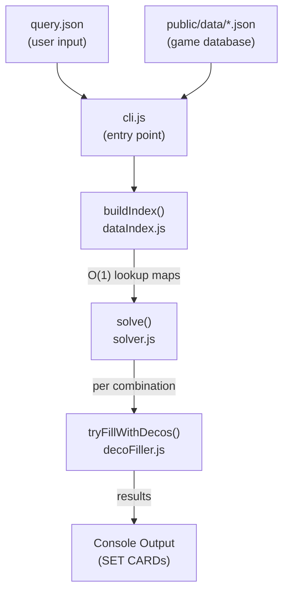
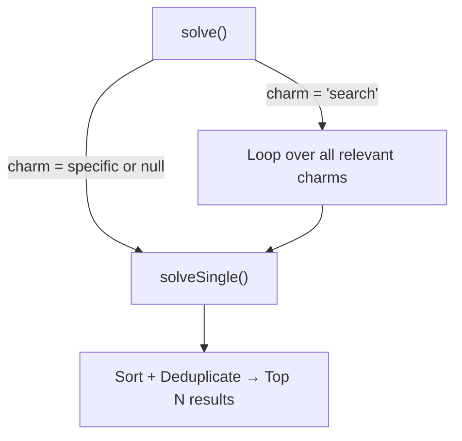

# MH Wilds Armor Set Builder — Full Backend Specs

## Overview

This is an **armor set optimization solver** for Monster Hunter Wilds. Given a list of desired skills (with target levels), a weapon configuration, and optionally a charm, it finds valid combinations of 5 armor pieces + decorations that satisfy all skill requirements.

**Run it with:** `npm run search` (which executes `node cli.js`)

---

## Architecture — The Pipeline



---

## 1. Data Source & Fetching

### Where the data comes from
- **API**: `https://wilds.mhdb.io/en` (endpoints: `/armor`, `/armor/sets`, `/skills`, `/decorations`, `/charms`, `/weapons`)
- **Fetch script**: [fetch_data.ps1](file:///d:/CLIENT FOR ASP/mhwildsbuilder/fetch_data.ps1) — a one-time PowerShell script (`npm run fetch-data`) that pulls all data and saves it to `data/` as local JSON files
- **Served at runtime from**: [public/data/](file:///d:/CLIENT FOR ASP/mhwildsbuilder/public/data) (6 JSON files used by the solver)

### The 6 Game Data Files

| File | Shape | Key Fields |
|------|-------|-----------|
| `armor.json` | Array of armor pieces | `id`, `name`, `kind` (head/chest/arms/waist/legs), `rank` (low/high), `rarity`, `defense` {base, max}, `resistances`, `skills` [{skillId, level, setPiecesRequired?}], `slots` [1-3], `setId` |
| `skills.json` | Array of skills | `id`, `name`, `kind` (armor/weapon/set/group), `maxLevel`, `ranks` [{level, description, setPiecesRequired?}] |
| `decorations.json` | Array of jewels | `id`, `name`, `slot` (1/2/3), `kind` (armor/weapon), `skills` [{skillId, level}] |
| `weapons.json` | Array of weapons | `id`, `name`, `kind`, `damage`, `affinity`, `slots`, `skills` |
| `charms.json` | Array of charms | `id`, `name`, `ranks` [{name, rarity, skills}], `random` |
| `armor-sets.json` | Array of armor sets | `id`, `name`, `pieceIds`, `setBonus` {skillId}, `groupBonus` {skillId} |

---

## 2. query.json — The Input

[query.json](file:///d:/CLIENT FOR ASP/mhwildsbuilder/query.json) is where you define **what build you want**.

```json
{
  "skills": [
    { "name": "Critical Boost", "level": 3 },
    { "name": "Weakness Exploit", "level": 5 }
    // ... more skills
  ],
  "weapon": {
    "slots": [3, 3, 3],          // decoration slot levels on your weapon
    "skills": [                   // innate weapon skills
      { "name": "Lord's Soul", "level": 1 }
    ],
    "setName": "Gogmazios α"      // weapon counts toward this armor set
  },
  "charm": null,                  // null = no charm, omit or "search" = auto-search best charm
  "rank": "high",                 // "low" | "high" | "all"
  "maxResults": 10
}
```

### Charm Modes

| Value | Behavior |
|-------|----------|
| `null` | No charm — solve without one |
| Omitted / `"search"` | **Auto-search mode** — solver iterates over all relevant charms + no-charm to find the best overall results |
| `{ "name": "Challenger Charm III" }` | Use this specific charm |

---

## 3. cli.js — The Entry Point

[cli.js](file:///d:/CLIENT FOR ASP/mhwildsbuilder/cli.js) orchestrates the full pipeline:

### Step-by-step:

1. **Read query.json** — parse the user's desired skills, weapon, charm, rank filter
2. **Load all 6 JSON data files** from `public/data/`
3. **Armor Transcendence (Pre-baked)** — Note that armor transcendence (max defense boost and slot upgrades) and set skill contributions are pre-baked into `armor.json` at build time by `buildData.cjs`. This eliminates the need for runtime calculations during search or index building.
4. **Build search index** — call `buildIndex()` to create O(1) lookup maps
5. **Resolve names → IDs** — match query skill names (case-insensitive) to actual `skillId`s in the database. Same for weapon set name and charm name
6. **Construct search params** — build the `params` object with resolved IDs
7. **Run the solver** — call `solve()`, collect results via callback
8. **Print results** — display each matching armor set as a "SET CARD"

---

## 4. buildIndex() — The Data Index

[dataIndex.js](file:///d:/CLIENT FOR ASP/mhwildsbuilder/src/data/dataIndex.js) transforms flat JSON arrays into fast-lookup data structures.

### Indices Created

| Index | Type | Purpose |
|-------|------|---------|
| `armorById` | `Map<id, armor>` | Direct armor lookup |
| `armorBySlot` | `Map<kind, armor[]>` | All pieces for head/chest/arms/waist/legs |
| `armorBySkill` | `Map<skillId, armor[]>` | All pieces that grant a skill |
| `skillById` | `Map<id, skill>` | Direct skill lookup |
| `skillByName` | `Map<name, skill>` | Name → skill (lowercased) |
| `decoById` | `Map<id, deco>` | Direct decoration lookup |
| `decoBySkill` | `Map<skillId, deco[]>` | All decos that grant a skill |
| `decoBySlotAndKind` | `Map<"slot:kind", deco[]>` | Decos by slot level + armor/weapon kind |
| `weaponById` | `Map<id, weapon>` | Direct weapon lookup |
| `weaponsByType` | `Map<kind, weapon[]>` | Weapons grouped by type |
| `charmById` | `Map<id, charm>` | Direct charm lookup |
| `charmOptions` | `Array` | Flattened charm ranks (each rank = one searchable option) |
| `charmBySkill` | `Map<skillId, charmOption[]>` | Charms that grant a skill |
| `setById` | `Map<id, armorSet>` | Direct armor set lookup |
| `setByPieceId` | `Map<pieceId, armorSet>` | Which set an armor piece belongs to |

### Precomputed Per-Piece Data

Each armor piece gets a `contributesToSetSkills` array — the set of `skillId`s this piece can contribute to via set bonuses or group bonuses. This is pre-baked at build time by the data builder script into the JSON database.

---

## 5. solve() — The Solver Engine

[solver.js](file:///d:/CLIENT FOR ASP/mhwildsbuilder/src/search/solver.js) is the brain. It uses **constraint propagation + branch-and-bound search**.

### High-Level Flow



### solveSingle() — The Core Algorithm

#### Phase 1: Compute Remaining Skill Needs
- Start with the full list of required skills from the query
- **Subtract** weapon innate skills (if weapon grants Weakness Exploit Lv1, and you need Lv5, remaining = Lv4)
- **Subtract** charm skills
- Remove any skills already at 0 or below — they're satisfied

#### Phase 2: Build Candidate Armor Lists
For each of the 5 armor slots (`head`, `chest`, `arms`, `waist`, `legs`):
1. Get all armor pieces of that slot type
2. **Filter** by rank (low/high/all)
3. **Filter** to pieces that contribute *something useful*:
   - Has a relevant skill (one you need)
   - Has decoration slots (can hold jewels)
   - Belongs to a set whose bonus is a desired skill
4. **Sort** by relevance score (more desired skill levels = higher priority)
5. **Prune strictly dominated pieces** — if piece A is ≥ piece B in every dimension (skills, slots, set bonuses), remove B. This dramatically reduces the search space

#### Phase 3: Precompute Pruning Bounds
Before searching, precompute upper bounds for aggressive branch pruning:

| Precomputed Data | What It Stores |
|-----------------|----------------|
| `maxFutureArmorPoints[slotIdx][skillId]` | Max skill levels achievable from remaining (unfilled) armor slots |
| `maxFutureSetPieces[slotIdx][skillId]` | Max set piece count achievable from remaining slots |
| `bestDecoForSkill[skillId]` | Best decoration: highest level per slot for each skill |
| `maxFutureSlotsGTE[slotIdx][level]` | Max deco slots of level ≥ 1/2/3 from remaining armor pieces |

#### Phase 4: Branch and Bound (Recursive DFS)

```
branch(slotIndex):
  if slotIndex == 5:        // All 5 pieces chosen
    → compute remaining needs after set bonuses
    → tryFillWithDecos()     // attempt decoration filling
    → if success: emit result
    return
  
  for each candidate piece in slot[slotIndex]:
    PUSH piece (add skills, slots, set counts)
    
    PRUNE CHECK:
      // NEW: Set piece count check (Prunes early before heavier loops)
      for each required set skill:
        if currentSetCount + maxFuture < piecesRequired → PRUNE

      for each required skill still unsatisfied:
        remaining = needed - achieved
        futureArmorPoints = precomputed max from remaining slots
        futureSetBonus = precomputed max set bonus possible
        decoGap = remaining - futureArmorPoints - futureSetBonus
        if decoGap > 0:
          estimate min decoration slots needed
          if no decos exist for this skill → PRUNE
    
      PIGEONHOLE CHECK:
        total needed size-3 deco slots > total available? → PRUNE
        total needed size-2+ deco slots > total available? → PRUNE
    
    if not pruned:
      branch(slotIndex + 1)    // recurse deeper
    
    POP piece (backtrack: undo all state changes)
```

> [!IMPORTANT]
> The solver uses **mutable typed arrays** (`Int32Array(1000)`) for skill/set tracking instead of Maps — this is a deliberate performance optimization for the tight inner loop. Skills and sets are indexed by their numeric ID directly.

#### Phase 5: Set/Group Bonus Resolution
When all 5 pieces are chosen, before decoration filling:
- Count how many pieces from each set are equipped (including weapon if it has a `setId`)
- Check if set bonus or group bonus thresholds are met (e.g., "3 pieces of Rathalos set activates Rathalos's Flare")
- Subtract bonus skill levels from remaining needs

---

## 6. tryFillWithDecos() — The Decoration Filler

[decoFiller.js](file:///d:/CLIENT FOR ASP/mhwildsbuilder/src/search/decoFiller.js) takes a chosen armor+weapon combination and tries to fill the remaining skill gaps with decorations.

### Key Constraint
Decorations have a `kind`:
- `"weapon"` decos → can **only** go in **weapon** slots
- `"armor"` decos → can **only** go in **armor** slots

### Algorithm

1. Sort remaining skills by **most constrained first** (fewest decoration options)
2. For each unsatisfied skill, greedily pick the best decoration:
   - Priority: highest skill level contribution → smallest slot size → best hybrid bonus (decos that also help other needed skills)
3. Place each deco in the **smallest available slot** that fits (to save larger slots for larger decos)
4. When a hybrid deco (e.g., gives both Fire Attack +3 and Ballistics +1) is placed, **all** its skills are deducted from needs
5. If any skill can't be placed → return `null` (fail)

### Slot Matching
A decoration of slot level N can go into any slot of level ≥ N:
- Size 1 deco → fits in slot 1, 2, or 3
- Size 3 deco → only fits in slot 3

---

## 7. Charm Auto-Search Mode

When `charm` is `"search"` or omitted in the query:

1. Build a list of **candidate charms**: all charms that have at least one skill matching a desired skill, plus a "no charm" option.
2. **Rank Filtering**: To prevent redundant search runs, the solver groups candidate charms by `charmId` and only tests the highest rank of each charm (e.g. `Exploiter Charm III` instead of `I`, `II`, and `III`), reducing search time by ~2.8x.
3. Run `solveSingle()` once per candidate charm (with `maxResults * 2` to get more candidates).
4. **Aggregate** all results, **sort** by quality, **deduplicate** (same armor pieces + same charm = duplicate), and **take top N**.

---

## 8. Result Sorting

Results are ranked by (in priority order):
1. **Skills fully satisfied** — count of required skills at max level
2. **Total required skill levels** — sum of achieved levels for required skills
3. **Max defense** — higher is better
4. **Spare slots** — more unused deco slots = more flexibility

---

## 9. Result Object (SET CARD)

Each result contains:

| Field | Description |
|-------|-------------|
| `pieces[]` | Array of 5 armor pieces with id, name, kind, skills, slots |
| `weapon` | Weapon info (id, name, slots, skills) |
| `charm` | Charm info (name, skills) or null |
| `decoAssignments[]` | Each deco placed: decoName, slotLevel, slotSource (armor/weapon), skillId, skillLevel |
| `bonusSkills[]` | Active set/group bonus skills |
| `totalDefense` | {base, max} summed across all pieces |
| `totalResistances` | {fire, water, ice, thunder, dragon} summed |
| `activeSkills[]` | All skills active on the build: name, level, maxLevel, isRequired, isBonusSkill |
| `spareSlots` | {armor, weapon} — unused decoration slots remaining |

---

## 10. Piece Pruning (Dominance Check)

[comparePieces()](file:///d:/CLIENT FOR ASP/mhwildsbuilder/src/search/solver.js#L695-L769) determines if piece A **strictly dominates** piece B:

Piece A dominates B if it is **≥** in all three dimensions:
1. **Skills**: For every desired skill, A provides ≥ levels
2. **Slots**: A has ≥ slots at ≥ levels (sorted descending)  
3. **Set Bonuses**: A contributes to ≥ set/group bonuses for desired skills

If A dominates B → B is removed from candidates (it can never produce a better result).
If they are functionally identical → keep the one with higher max defense.

---

## File Map Summary

```
mhwildsbuilder/
├── cli.js                          ← Entry point (npm run search)
├── query.json                      ← User input: desired build
├── fetch_data.ps1                  ← One-time data fetch from API
├── public/data/                    ← Game database (6 JSON files)
│   ├── armor.json
│   ├── armor-sets.json
│   ├── skills.json
│   ├── decorations.json
│   ├── charms.json
│   └── weapons.json
├── src/
│   ├── data/
│   │   ├── dataIndex.js            ← buildIndex(): creates O(1) lookup maps
│   │   └── dataLoader.js           ← Browser data loader (fetch-based, not used by CLI)
│   └── search/
│       ├── solver.js               ← solve()/solveSingle(): branch-and-bound search
│       ├── decoFiller.js           ← tryFillWithDecos(): greedy decoration placement
│       └── searchWorker.js         ← Web Worker wrapper (for browser UI, not CLI)
└── package.json                    ← Scripts: search, dev, build, fetch-data
```

> [!NOTE]
> [dataLoader.js](file:///d:/CLIENT FOR ASP/mhwildsbuilder/src/data/dataLoader.js) and [searchWorker.js](file:///d:/CLIENT FOR ASP/mhwildsbuilder/src/search/searchWorker.js) are for the **browser frontend** (Vite-based). The CLI path uses `fs.readFileSync` directly and runs the solver synchronously on the main thread.
