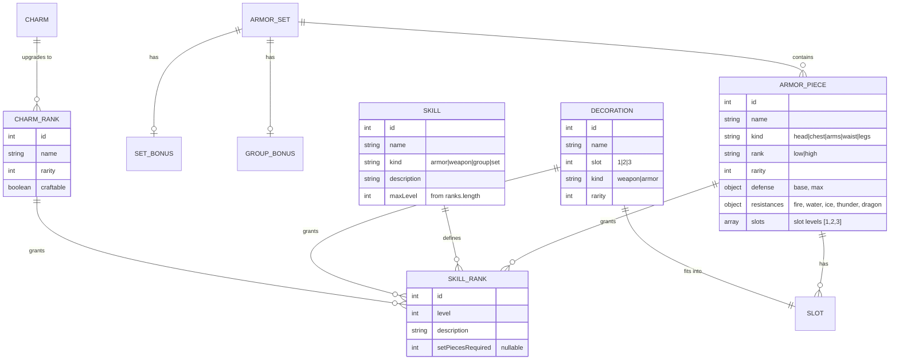
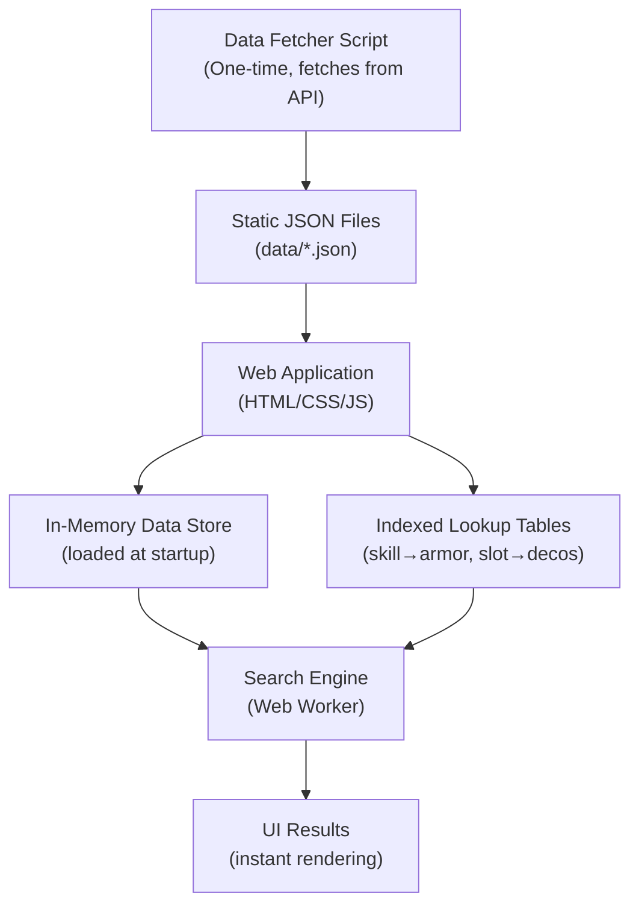

# MH Wilds Armor Builder — Research & Data Collection

## 1. API Overview

| Detail | Value |
|---|---|
| **Base URL** | `https://wilds.mhdb.io/{locale}/` |
| **Docs** | [docs.wilds.mhdb.io](https://docs.wilds.mhdb.io/) |
| **Locale** | `en` (English) — always required in the path |
| **Auth** | None (public, no key required) |
| **Rate Limiting** | Unknown — should cache locally |
| **Format** | JSON responses only |

### Query Parameters

| Parameter | Description | Example |
|---|---|---|
| `p` | **Projection** — control which fields are returned | `?p={"name":true,"skills":true}` |
| `q` | **Filter** — filter objects in the response | `?q={"kind":"head"}` |

> [!IMPORTANT]
> The `?limit=N` parameter exists but was not explicitly documented. We observed it working to limit array results.

---

## 2. Data Inventory (Live Counts)

| Endpoint | URL | Count |
|---|---|---|
| **Armor Pieces** | `/en/armor` | **714** |
| **Armor Sets** | `/en/armor/sets` | **194** |
| **Skills** | `/en/skills` | **179** |
| **Decorations** | `/en/decorations` | **361** |
| **Charms** | `/en/charms` | **64** |

### Armor Breakdown by Slot Type (`kind`)

| Slot | Count |
|---|---|
| `head` | 164 |
| `chest` | 140 |
| `arms` | 135 |
| `waist` | 137 |
| `legs` | 138 |

### Armor Breakdown by Rank

| Rank | Count |
|---|---|
| `low` | 132 |
| `high` | 582 |

### Decoration Breakdown

**By Kind (where the deco can be equipped):**
| Kind | Count |
|---|---|
| `weapon` | 295 |
| `armor` | 66 |

**By Slot Level:**
| Slot Level | Count |
|---|---|
| 1 | 82 |
| 2 | 58 |
| 3 | 221 |

### Skill Breakdown by Kind

| Kind | Count | Description |
|---|---|---|
| `armor` | 71 | Standard armor skills |
| `weapon` | 66 | Weapon-specific skills |
| `group` | 17 | Group/set bonus skills (e.g., 3-piece bonuses) |
| `set` | 25 | Set bonus skills |

---

## 3. Data Structures (Real API Responses)

### 3.1 Armor Piece

```json
{
  "id": 1,
  "name": "Conga Helm α",
  "description": "Head armor made from Congalala materials...",
  "rank": "high",          // "low" | "high"
  "rarity": 5,
  "kind": "head",           // NOT in limit=1 response but from the full endpoint
  "resistances": {
    "fire": -3,
    "water": 1,
    "ice": -1,
    "thunder": 1,
    "dragon": 2
  },
  "defense": {
    "base": 36,
    "max": 76
  },
  "skills": [
    {
      "id": 279,
      "skill": {
        "id": 111,
        "gameId": 850626240,
        "name": "Free Meal",
        "kind": "armor",
        "icon": { "id": 11, "kind": "item" }
      },
      "level": 1,
      "name": null,           // null for regular skills
      "description": "Activates 10% of the time.",
      "setPiecesRequired": null  // null for regular, number for set bonuses
    },
    {
      "id": 394,
      "skill": {
        "id": 150,
        "name": "Fortifying Pelt",
        "kind": "group"           // group bonus skill
      },
      "level": 1,
      "name": "Fortify",           // named sub-skill for group bonuses
      "description": "Increases attack and defense after fainting...",
      "setPiecesRequired": 3       // requires 3 pieces of the set
    }
  ],
  "slots": [1],                // array of slot levels (1, 2, or 3)
  "armorSet": {
    "id": 1,
    "name": "Conga α"
  },
  "crafting": {
    "id": 1,
    "armor": { "id": 1 },
    "materials": [
      {
        "id": 1,
        "item": {
          "id": 467,
          "name": "Congalala Pelt+",
          "rarity": 6,
          "value": 930
          // ... more item fields
        },
        "quantity": 2
      }
    ],
    "zennyCost": 3000
  }
}
```

> [!NOTE]
> The `kind` field (head/chest/arms/waist/legs) identifies which equipment slot this armor piece occupies. This is **critical** for the set builder — you need exactly one piece per slot.

### 3.2 Skill

```json
{
  "id": 1,
  "gameId": -2125233152,
  "name": "Dragon Resistance",
  "kind": "armor",            // "armor" | "weapon" | "group" | "set"
  "description": "Increases dragon resistance. Also improves defense at higher levels.",
  "icon": {
    "id": 6,
    "kind": "defense"
  },
  "ranks": [
    {
      "id": 1,
      "skill": { "id": 1 },
      "level": 1,
      "name": null,
      "description": "Dragon resistance +6",
      "setPiecesRequired": null
    },
    {
      "id": 2,
      "skill": { "id": 1 },
      "level": 2,
      "description": "Dragon resistance +12",
      "setPiecesRequired": null
    },
    {
      "id": 3,
      "skill": { "id": 1 },
      "level": 3,
      "description": "Dragon resistance +20 Defense +10",
      "setPiecesRequired": null
    }
  ]
}
```

> [!IMPORTANT]
> Skills have a `kind` field distinguishing between regular armor skills, weapon skills, group bonuses (multi-piece set bonuses), and set bonuses. The armor builder primarily needs `armor` and `group` kind skills.

### 3.3 Decoration

```json
{
  "id": 1,
  "gameId": -2144349312,
  "name": "Venom Jewel [1]",
  "description": "A decoration that grants the Poison Attack skill.",
  "value": 150,
  "slot": 1,                   // slot level required (1, 2, or 3)
  "rarity": 3,
  "kind": "weapon",            // "weapon" | "armor" — where it can be equipped
  "skills": [
    {
      "id": 25,
      "skill": {
        "id": 12,
        "name": "Poison Attack"
      },
      "level": 1,
      "description": "Poison buildup +5% Bonus: +10",
      "setPiecesRequired": null
    }
  ],
  "icon": {
    "color": "purple",
    "colorId": 20
  }
}
```

> [!WARNING]
> Decorations have a `kind` field — `"weapon"` decos can only go in weapon slots, `"armor"` decos can only go in armor slots. This is a **critical constraint** for the search algorithm.

### 3.4 Armor Set

```json
{
  "id": 1,
  "gameId": -2117203456,
  "name": "Conga α",
  "pieces": [
    {
      "id": 1,
      // ... full armor piece object (same as 3.1)
    },
    // ... 5 pieces total (head, chest, arms, waist, legs)
  ],
  "bonus": null,               // set bonus (if any)
  "setBonusSkill": null,       // set bonus skill (if any)
  "groupBonus": {              // group bonus (e.g., 3-piece bonus)
    "id": 1,
    "skill": {
      "id": 150,
      "name": "Fortifying Pelt"
    },
    "ranks": [
      {
        "id": 1,
        "pieces": 3,           // pieces required for this rank
        "skill": {
          "skill": { "id": 150 },
          "level": 1,
          "name": "Fortify",
          "description": "Increases attack and defense after fainting...",
          "setPiecesRequired": 3
        }
      }
    ]
  },
  "groupBonusSkill": {
    // ... full skill object for the group bonus
  }
}
```

### 3.5 Charm

```json
{
  "id": 1,
  "gameId": -2084662144,
  "name": "Poison Charm",
  "ranks": [
    {
      "id": 1,
      "name": "Poison Charm I",
      "rarity": 4,
      "skills": [
        {
          "skill": { "id": 12, "name": "Poison Attack" },
          "level": 1,
          "description": "Poison buildup +5% Bonus: +10"
        }
      ],
      "crafting": {
        "craftable": true,     // can it be crafted directly?
        "materials": [...],
        "zennyCost": 2000
      }
    },
    {
      "id": 2,
      "name": "Poison Charm II",
      "rarity": 5,
      "skills": [
        {
          "skill": { "id": 12, "name": "Poison Attack" },
          "level": 2,
          "description": "Poison buildup +10% Bonus: +10"
        }
      ],
      "crafting": {
        "craftable": false,    // requires upgrade from Charm I
        "materials": [...],
        "zennyCost": 6000
      }
    }
  ],
  "random": false              // whether this is a random charm
}
```

---

## 4. Key Data Relationships (Entity Diagram)



---

## 5. Data Collection Strategy

### Approach: **Fetch Once, Cache Locally as JSON**

The Athena ASS approach worked because all data was local — no network latency. We should do the same:

1. **Write a data fetcher script** that calls all API endpoints and saves them as local JSON files
2. **Store the data** in the project as static JSON files: `data/armor.json`, `data/skills.json`, etc.
3. **Use projection (`?p=`)** to only fetch the fields we actually need, reducing payload size
4. **Flatten/normalize the data** for efficient lookup during search

### Fields We Need per Entity (for the armor builder):

**Armor (minimal set for search):**
```
id, name, kind, rank, rarity, defense, resistances, skills[{skill.id, level}], slots[], armorSet.id
```

**Skills:**
```
id, name, kind, description, ranks[{level, description, setPiecesRequired}], maxLevel
```

**Decorations:**
```
id, name, slot, kind, rarity, skills[{skill.id, level}]
```

**Charms:**
```
id, name, ranks[{name, rarity, skills[{skill.id, level}]}], random
```

**Armor Sets (for set/group bonuses):**
```
id, name, bonus, setBonusSkill, groupBonus, groupBonusSkill
```

---

## 6. Architecture Proposal

### Why Athena's ASS Was Fast

Athena's ASS was a native desktop app (C++ / Delphi) that:
1. Loaded **all data in-memory** at startup
2. Used **constraint-based search** (essentially a CSP solver) — not brute force
3. Precomputed lookup tables (skill → armor pieces that have it, etc.)
4. Ran search on a **background thread** so the UI stayed responsive

### Our Architecture: Web-based (Offline-First)



### Tech Stack Decision Points

| Component | Option A | Option B | Recommendation |
|---|---|---|---|
| **Framework** | Vanilla HTML/JS | Vite + React/Vue | **Vanilla first** — Athena was fast because of simplicity |
| **Search** | Main thread | **Web Worker** | Web Worker — keeps UI responsive during search |
| **Data Store** | JSON files bundled | IndexedDB | JSON files — small enough (~1MB total) |
| **Styling** | Vanilla CSS | TailwindCSS | **Vanilla CSS** — full control over MH aesthetic |
| **Algorithm** | Brute force | **Constraint propagation** | Constraint propagation — the secret to Athena's speed |

### Core Search Algorithm (Athena-style)

The key insight: **Don't search all combinations. Prune early.**

```
Input: Desired skills + levels, optional constraints (weapon slots, max rank, etc.)

1. For each desired skill:
   - Build a list of "skill sources" (armor pieces, decorations, charms that provide it)

2. For each armor slot (head, chest, arms, waist, legs):
   - Filter to pieces that contribute to at least one desired skill
   - This dramatically reduces the search space

3. Use branch-and-bound / constraint propagation:
   - Pick a slot, try each candidate armor piece
   - After each pick, check: "Can the remaining slots + decorations still reach the target?"
   - If not, prune this branch immediately
   - If yes, continue to next slot

4. After all 5 armor slots are filled:
   - Calculate remaining skill needs
   - Try to fill with decorations (greedy, highest-slot-first)
   - If successful → valid set found

5. Score and rank results by:
   - Total defense, total resistances, spare slots, extra skills
```

---

## 7. Open Questions

> [!IMPORTANT]
> These decisions will affect how we build the application:

1. **Scope**: Do we want weapons in the builder too, or armor-only for v1?
2. **Set Bonuses**: The API has both `bonus/setBonusSkill` AND `groupBonus/groupBonusSkill` on armor sets. We need to handle both in the search.
3. **Charm Handling**: Should charms be a fixed input ("I have this charm") or part of the search space?
4. **Rank Filter**: Should users be able to filter by Low Rank / High Rank, or always show all?
5. **Decoration Kind Constraint**: `weapon` decos can only go in weapon slots, `armor` decos only in armor slots — do we model weapon deco slots at all, or just armor?
6. **UI Style**: Classic Athena-style (functional, table-heavy) or modern MH-themed dark UI?
